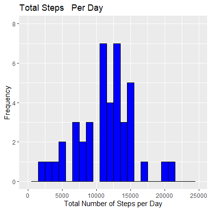
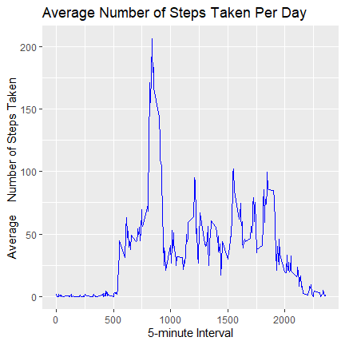
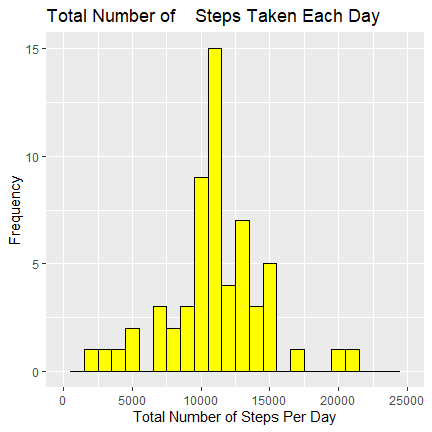
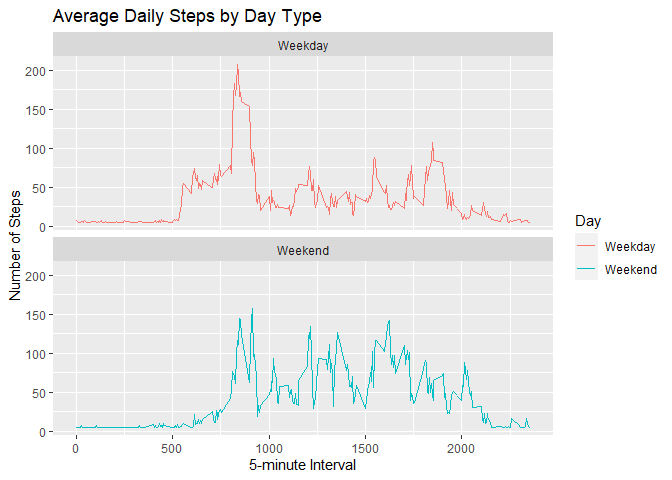

```r
   knitr::opts_chunk$set(echo = TRUE)
```

## Loading and preprocessing the data
unzip the dataset

```r
   unzip("activity.zip")
```

read the activity csv file

```r
   activitydata<- read.csv("activity.csv", header=TRUE, stringsAsFactors = FALSE)
```

check the structure of the data

```r
   str(activitydata)
```

```
## 'data.frame':	17568 obs. of  3 variables:
##  $ steps   : int  NA NA NA NA NA NA NA NA NA NA ...
##  $ date    : chr  "2012-10-01" "2012-10-01" "2012-10-01" "2012-10-01" ...
##  $ interval: int  0 5 10 15 20 25 30 35 40 45 ...
```

process the data by changing date format

```r
   activitydata$date<- as.Date(activitydata$date, format= "%Y-%m-%d")
```

## What is mean total number of steps taken per day?
total number of steps taken per day

```r
   totalsteps<- with(activitydata, aggregate(steps, by= list(date), sum, na.rm=TRUE))
```

Name the columns

```r
   names(totalsteps)<- c("date", "steps")
```

plot histogram of total number of steps taken per day 

```r
   library(ggplot2)
```

```
## Warning: package 'ggplot2' was built under R version 4.0.3
```

```r
   g<- ggplot(totalsteps, aes(x= as.numeric(steps)))
   g+ geom_histogram(col= "black", fill= "blue", binwidth = 1000)+ labs(title= "Total Steps   Per Day", x= "Total Number of Steps per Day", y= "Frequency")+ xlim(0,25000)+ ylim(0, 8)
```

```
## Warning: Removed 3 rows containing missing values (geom_bar).
```

<!-- -->
the mean of the total number of steps taken per day is:

```r
   mean(totalsteps$steps)
```

```
## [1] 9354.23
```

the median of the total number of steps taken per day is:

```r
   median(totalsteps$steps)
```

```
## [1] 10395
```

## What is the average daily activity pattern?
calculate the mean of steps by interval

```r
   averageSteps<- with(activitydata, aggregate(steps, by= list(interval), FUN=mean,     na.rm=TRUE))
```

name the columns

```r
   names(averageSteps)<- c("Interval", "Mean")
```

plot time series graph

```r
   g<- ggplot(averageSteps, mapping= aes(x= as.numeric(Interval), y= as.numeric(Mean)))
   g+geom_line(col= "blue")+ labs(title= "Average Number of Steps Taken Per Day", y= "Average    Number of Steps Taken", x= "5-minute Interval")
```

<!-- -->

Interval that contains the maximum number of steps is:

```r
   averageSteps[which.max(averageSteps$Mean),]$Interval
```

```
## [1] 835
```

## Imputing missing values
total number of missing values in the dataset

```r
   sum(is.na(activitydata))
```

```
## [1] 2304
```

Create a new dataset and fill in all of the missing values in the dataset

```r
   completeData<- activitydata
   completeData$steps[is.na(completeData$steps)]= mean(completeData$steps, na.rm=TRUE)
```

check if the dataset still contains any missing values

```r
   sum(is.na(completeData))
```

```
## [1] 0
```
calculate the total number of steps taken each day

```r
   completeDataSum<-with(completeData, aggregate(steps, by= list(date), sum))
```

name the columns

```r
   names(completeDataSum)<- c("Date", "Steps")
```

make a histogram of the total number of steps taken each day

```r
   g<- ggplot(completeDataSum, aes(x= as.numeric(Steps)))
   g+ geom_histogram(col="black", fill="yellow", binwidth= 1000)+ labs(title= "Total Number of    Steps Taken Each Day", x= "Total Number of Steps Per Day", y= "Frequency")+ ylim(0,15)+       xlim(0,25000)
```

```
## Warning: Removed 2 rows containing missing values (geom_bar).
```

<!-- -->
the mean total number of steps taken per day is:

```r
   mean(completeDataSum$Steps)
```

```
## [1] 10766.19
```
the median total number of steps taken per day is:

```r
   median(completeDataSum$Steps)
```

```
## [1] 10766.19
```
From the above computations, the mean and median values are different from the estimates from the first part of assignment. Imputing missing data might cause bias to the data assessment.

## Are there differences in activity patterns between weekdays and weekends?
check the structure of data

```r
   str(completeData)
```

```
## 'data.frame':	17568 obs. of  3 variables:
##  $ steps   : num  37.4 37.4 37.4 37.4 37.4 ...
##  $ date    : Date, format: "2012-10-01" "2012-10-01" ...
##  $ interval: int  0 5 10 15 20 25 30 35 40 45 ...
```

create new factor variable in dataset with 2 levels- "weekday" and "weekend"

```r
   completeData$Day<- sapply(completeData$date, function(x){
      if(weekdays(x)== "Saturday" | weekdays(x)== "Sunday")
      {y <- "Weekend"}
      else {y<- "Weekday"}
   y
   })
```

make a panel plot containing a time series plot of the 5-minute interval and the average number of steps taken

```r
   ByDay<- aggregate(steps ~ interval+ Day, completeData, FUN=mean, na.rm=TRUE)
   g<- ggplot(ByDay, aes(x= as.numeric(interval), y= as.numeric(steps), col= Day))
   g+geom_line()+ labs(title= "Average Daily Steps by Day Type", x= "5-minute Interval", y=      "Number of Steps")+ facet_wrap(~Day, nrow= 2, ncol=1)
```

<!-- -->

           
           
